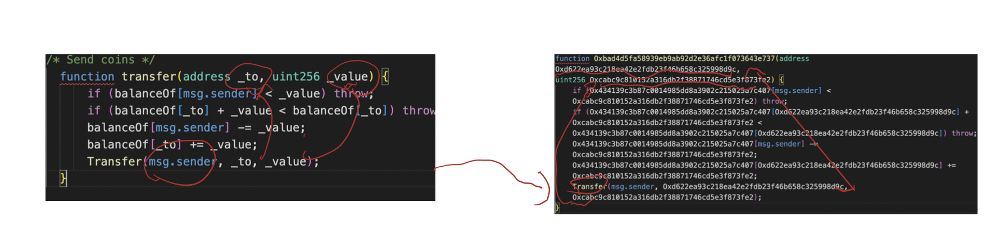

This repo contains 

- Original solidity file: org_file.sol
- Obfuscated file: obfus_file.sol
- Generated graph file for obfuscated file: transfer.dot, transfer.png
- Generated description for obfuscated file: descriptions.md

## Obfuscator

- tool: BiAn (https://github.com/xf97/BiAn), a source code level code obfuscation tool

## Obfuscation aspects

- layout obfuscation
  - delete comments
  - disrupt the formatting
  - replace variable's name
- data flow obfuscation
  - convert local variables to state variables
  - dynamically generate static data
  - convert integer literals to arithmetic expressions
  - split Boolean variables
  - scalar to vector

## Demo

The demo is a `transfer` function aiming to transfer a user input amount from a user to a user input address. After the obfuscation, the variable names and the state variables are changed. But we can analyze existing event `Transfer()`, and we get parameters used in the event:  `msg.sender`, a user input address and a user input value.

## Generated Description

The function transfers a user input amount from a user to a user input address.

