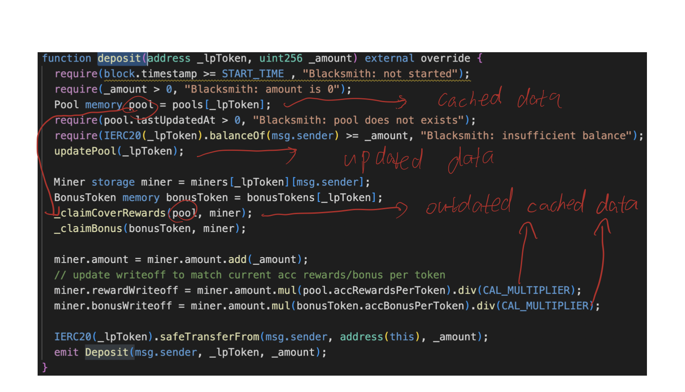

The repo contains the source code of Blacksmith, which is exploited in the Cover protocol.

## Introduction

The contract caches the pool data in memory to save some gas, and updates the pool data in storage but forgets to update the cached data. The attacker used the cached data to raise the price of minting rewards and transfer them to his own account.

## Description

The description for using cached data to transfer rewards should be:

**The function transfers an amount using a user input value**

There is **no pre-calculation** for the transfer because it only used the cached data and there is no update on it.

However, if the data is updated and then used for the transfer, there is a calculation for the amount first, and then this amount is transferred.

**The function calculates an amount using a user input value and a timestamp, and then transfers this amount to a user input address**
